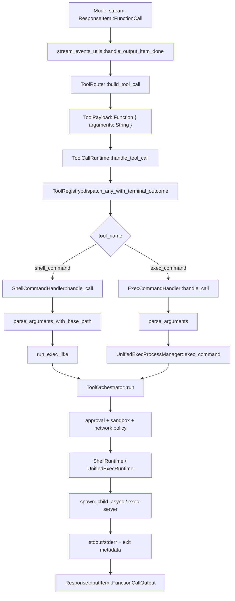

# Codex Harness 源码解析：工具调用链路与真实测试流程

日期：2026-07-10
分析版本：`openai/codex` commit `dc5ae37`
源码根目录占位：`<codex-source>`

这版只抓三件事：

1. JSON/function call 到 shell 进程的真实链路。
2. Codex 源码里的真实 TDD/测试流程。
3. 当前源码 TODO/限制。

## 0. 最短结论

Codex 不是把 JSON 直接扔给 bash。

```text
model function_call.arguments(JSON string)
  -> ToolRouter 只封装，不解析
  -> ToolRegistry 找 handler
  -> handler 用 serde_json 解析成强类型参数
  -> ToolOrchestrator 做审批、沙箱、网络策略
  -> ShellRuntime / UnifiedExecProcessManager 拉起进程
  -> ToolOutput 写成 function_call_output
  -> 下一轮 Responses 请求带回给模型
```

## 1. 工具调用链路图

GitHub 可以渲染 Mermaid：



ASCII 版：

```text
ResponseItem::FunctionCall
  name: "shell_command" | "exec_command"
  arguments: "{\"cmd\":\"echo hi\"}"   <-- 这里仍是字符串
        |
        v
stream_events_utils::handle_output_item_done
        |
        v
ToolRouter::build_tool_call
  -> ToolCall { tool_name, call_id, payload: Function { arguments } }
        |
        v
ToolCallRuntime
  -> 并发闸门 / cancellation / tool future
        |
        v
ToolRegistry
  -> 找 handler
  -> pre_tool_use hook
  -> handler.handle(...)
  -> post_tool_use hook
        |
        +--> shell_command
        |      ShellCommandHandler
        |        -> serde_json::from_str<ShellCommandToolCallParams>
        |        -> run_exec_like
        |        -> ToolOrchestrator
        |        -> ShellRuntime
        |        -> spawn_child_async
        |
        `--> exec_command
               ExecCommandHandler
                 -> serde_json::from_str<ExecCommandArgs>
                 -> allocate process_id
                 -> UnifiedExecProcessManager
                 -> ToolOrchestrator
                 -> UnifiedExecRuntime / exec-server
```

## 2. JSON 解析边界

真实边界在 handler，不在 router。

```rust
// codex-rs/core/src/tools/handlers/mod.rs
pub(crate) fn parse_arguments<T>(arguments: &str) -> Result<T, FunctionCallError>
where
    T: for<'de> Deserialize<'de>,
{
    serde_json::from_str(arguments).map_err(|err| {
        FunctionCallError::RespondToModel(format!("failed to parse function arguments: {err}"))
    })
}
```

`ToolRouter::build_tool_call` 只做封装：

```text
ResponseItem::FunctionCall { name, arguments, call_id }
  -> ToolCall {
       tool_name,
       call_id,
       payload: ToolPayload::Function { arguments }
     }
```

`arguments` 还是原始 JSON 字符串。

## 3. Codex 的真实 TDD/测试流程

这里才是源码里的 test harness，不是 runtime 自动 TDD。

### 3.1 官方要求

`AGENTS.md` 对 agent 逻辑改动的要求：

```text
agent changes -> prefer integration tests over unit tests
integration tests -> codex-rs/core/tests/suite
test instance -> test_codex
run tests -> just test, not cargo test
```

`codex_core integration testing` 还规定：

```text
Use core_test_support::responses
Use TestCodexBuilder::build_with_auto_env() by default
Hold ResponseMock to assert outbound /responses POST bodies
Use ResponsesRequest helpers:
  function_call_output
  custom_tool_call_output
  call_output
  body_json
Prefer mount_sse_once
Prefer wait_for_event
```

所以 Codex 的 TDD 是源码开发者写“假模型响应”，驱动真实 agent loop。

### 3.2 shell_command 测试的真实路径

典型用例：`codex-rs/core/tests/suite/tool_harness.rs::shell_command_tool_executes_command_and_streams_output`

```text
Arrange
  start_mock_server()
  test_codex().with_model("test-gpt-5-codex")
  builder.build(&server)

Fake model response #1
  ev_response_created("resp-1")
  ev_function_call(call_id, "shell_command", "{\"command\":\"echo tool harness\"}")
  ev_completed("resp-1")

Act
  codex.submit(Op::UserInput { text: "please run the shell command", ... })

Codex runtime really does
  run_turn
  -> handle_output_item_done
  -> ToolRouter
  -> ShellCommandHandler
  -> ShellRuntime
  -> real echo process

Fake model response #2
  ev_assistant_message("msg-1", "all done")
  ev_completed("resp-2")

Assert
  second_mock.single_request()
  -> request.function_call_output(call_id)
  -> output matches:
     Exit code: 0
     Wall time: ...
     Output:
     tool harness
```

这个测试证明的是闭环：

```text
fake model function_call
  -> real local shell execution
  -> function_call_output written into next /responses request
```

### 3.3 shell_command.rs 的红绿形状

`codex-rs/core/tests/suite/shell_command.rs` 把模式封成 helpers：

```text
shell_responses_with_timeout(...)
  -> JSON args { command, timeout_ms, login }
  -> ev_function_call(call_id, "shell_command", arguments)
  -> assistant "done"

mount_shell_responses(...)
  -> mount_sse_sequence(harness.server(), responses)

shell_command_works()
  -> mount "echo 'hello, world'"
  -> harness.submit("run the echo command")
  -> harness.function_call_stdout(call_id)
  -> assert_shell_command_output(...)
```

红绿点：

```text
red: shell 没执行 / 没回灌 -> function_call_stdout 找不到或 regex 不匹配
green: stdout 被格式化为 Exit code + Wall time + Output
```

### 3.4 exec_command / unified exec 测试流程

典型用例：`codex-rs/core/tests/suite/unified_exec.rs::exec_command_reports_chunk_and_exit_metadata`

```text
Arrange
  enable Feature::UnifiedExec
  builder.build_with_auto_env(&server)

Fake model response
  ev_function_call(call_id, "exec_command", {
    "cmd": "printf 'token one ...'",
    "yield_time_ms": 500,
    "max_output_tokens": 6
  })

Act
  submit_unified_exec_turn(..., PermissionProfile::Disabled)
  wait TurnComplete

Assert
  collect_tool_outputs(outbound /responses bodies)
  chunk_id is 6 hex chars
  wall_time >= 0
  completed process has no process_id
  exit_code == 0
  output contains truncation notice
  original_token_count exists
```

这说明 `exec_command` 的 harness 测试覆盖终端协议元数据，不只是 stdout。

### 3.5 实际要跑的命令

仓库根目录 `justfile` 把测试包装成 nextest：

```bash
just test -p codex-core --test all shell_command_tool_executes_command_and_streams_output
just test -p codex-core --test all shell_command_works
just test -p codex-core --test all exec_command_reports_chunk_and_exit_metadata
```

注意：

```text
不要直接 cargo test
just test -> cargo nextest run --no-fail-fast
```

本机当前缺 Rust toolchain / `just` / `cargo-nextest`，所以我没有跑源码级测试。

## 4. runtime 是否自动 TDD？

结论：不是。

Codex runtime 的能力是“模型可以调用 shell 工具执行测试命令”，不是“每轮自动 TDD”。

真正强制测试的是源码开发规范：

```text
改 agent 逻辑
  -> 写 core/tests/suite 集成测试
  -> mock Responses model
  -> 触发真实 run_turn/tool runtime
  -> 断言 outbound function_call_output
  -> just test -p codex-core ...
```

所以你日常使用 Codex/opencode 没看到自动 smoke/test/TDD，不奇怪。默认 runtime 没有独立“测试守护进程”强制执行测试。

## 5. 当前 TODO / 缺口

只列和 harness、tool、测试相关的。

### 5.1 remote / foreign path 还没完全统一

`exec_command.rs` 里有多个 PathUri TODO：

```text
Remove parsing split once sandboxing supports foreign paths
wire PathUri through implicit skills instead of skipping on foreign paths
Resolve requested shells in remote environments
Make permission matching operate on PathUri for remote environments
```

意思是：本地 POSIX 路径、Windows 路径、remote exec-server 路径还没完全统一。现在有些地方仍要转回 native absolute path。

### 5.2 unified exec runtime 仍有 PathUri 边界

`tools/runtimes/unified_exec.rs`：

```text
make sandboxing work for foreign OSes
Make shell snapshot lookup accept PathUri
```

`unified_exec/process_manager.rs`：

```text
Keep PathUri through the Windows sandbox launch boundary
Keep PathUri through the local PTY/process launch boundary
```

这说明 unified exec 的抽象已经往 remote/multi-OS 走，但底层 launch/sandbox 还留有 native path 接缝。

### 5.3 Windows remote smoke 有明确未覆盖项

`core/tests/remote_env_windows/README.md` 写了 smoke-test：

```bash
bazel test //codex-rs/core/tests/remote_env_windows:smoke-test --test_output=errors
```

当前限制：

```text
ConPTY/TTY behavior is not yet covered
target intentionally limited to x86-64
```

也就是说 remote Windows exec-server 有 smoke，但 TTY/ConPTY 还不是覆盖闭环。

### 5.4 compact 测试里有已知行为缺口

`core/tests/suite/compact.rs` 有一个 ignore：

```text
Re-enable after follow-up compaction behavior PR lands
Current main behavior around non-context manual /compact failures is known-incorrect
```

还有 pre-turn compaction 相关 TODO：

```text
Update once pre-turn compaction includes incoming user input
Update once context-overflow handling includes incoming user input
```

这不是 shell 工具本身的问题，但属于 agent turn harness 的测试缺口。

## 6. 动态验证

我之前用本机真实 Codex CLI 跑过一次最小探针：

```bash
codex -a never -s read-only -C /tmp/codex_dynamic_probe \
  exec --json --ephemeral --skip-git-repo-check --ignore-rules \
  "请只调用一次 shell/exec 工具执行这个命令：printf codex_dynamic_probe。执行后用一句话返回工具输出，不要做其他事。"
```

关键 JSONL：

```json
{"type":"item.started","item":{"type":"command_execution","command":"/bin/bash -lc 'printf codex_dynamic_probe'","status":"in_progress"}}
{"type":"item.completed","item":{"type":"command_execution","command":"/bin/bash -lc 'printf codex_dynamic_probe'","aggregated_output":"codex_dynamic_probe","exit_code":0,"status":"completed"}}
```

它证明 CLI 展示层的 `command_execution`，底下仍然是 harness 包装后的 shell 命令：

```text
/bin/bash -lc 'printf codex_dynamic_probe'
```

## 7. 该怎么读源码

按这个顺序读，不要从全仓库搜起：

```text
1. core/tests/suite/tool_harness.rs
   先看测试怎么伪造模型 function_call。

2. core/tests/common/responses.rs
   看 ev_function_call / mount_sse_once / mount_sse_sequence。

3. core/tests/common/test_codex.rs
   看 TestCodexHarness.submit 和 function_call_output 断言。

4. core/src/stream_events_utils.rs
   看 handle_output_item_done 如何把模型 item 交给 ToolRuntime。

5. core/src/tools/router.rs
   看 arguments 为什么还是字符串。

6. core/src/tools/handlers/shell/shell_command.rs
   看 shell_command 在哪里 serde_json parse。

7. core/src/tools/handlers/unified_exec/exec_command.rs
   看 exec_command 的 process_id / yield_time_ms / permissions。

8. core/src/tools/orchestrator.rs
   看审批、沙箱、重试。

9. core/src/spawn.rs
   看最后怎么 tokio::process::Command::spawn。
```

## 8. 参考

- OpenAI Codex source: https://github.com/openai/codex
- ISTQB test harness glossary: https://glossary.istqb.org/en_US/term/test-harness
